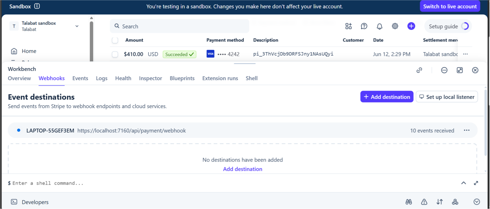

# Talabat API 🛒

An Enterprise-grade E-commerce API solution built with ASP.NET Core 8.

## 📋 Table of Contents
- [General Info](#general-info)
- [Screenshots](#screenshots)
- [Features & Roles](#features--roles)
- [Learning Outcomes](#learning-outcomes)
- [System Architecture](#system-architecture)
- [Dependencies](#dependencies)
- [Installation](#installation)
- [Usage](#usage)

---

## ℹ️ General Info
Talabat API is a comprehensive backend system designed to digitize the e-commerce ecosystem. It bridges the gap between end-users, product catalogs, and secure payment processing. Unlike simple CRUD applications, Talabat API solves critical operational problems like secure payment handling via Stripe webhooks and high-performance basket management using Redis.

---

## 📸 Screenshots
Here is a visual tour of the API endpoints and system data model:

| Account & Basket | Order & Payments | Product Endpoints |
| :---: | :---: | :---: |
|  |  |  |

| Database Diagram | Stripe Integration |
| :---: | :---: |
|  |  |

---

## 🚀 Features & Roles
The system is engineered around Role-Based Access Control (RBAC):

### 1. 🛡 Admin (System Manager)
- Product Management: Full CRUD operations on products, brands, and categories.
- Order Monitoring: Tracks all system orders and delivery methods.

### 2. 👤 Registered User
- Basket Management: Creates/Updates baskets with Redis caching.
- Checkout Flow: Selects delivery methods and processes payments.
- Order Tracking: Views order history and specific order status.

---

## 🎓 Learning Outcomes
Building Talabat API required mastering advanced .NET concepts: 
* Business Logic Implementation: Handling payment intents and success/failed simulations.
* Payment Webhooks: Implementing Stripe webhooks to synchronize payment states between Stripe and local database.
* Data Integrity: Ensuring financial consistency between basket totals and order items.
* Specification Pattern: Encapsulating query logic for clean and reusable product and order filtering.

---

## 🏗 System Architecture
- Backend: ASP.NET Core 8 MVC / Web API.
- Database: SQL Server using Entity Framework Core (Code-First).
- Caching: StackExchange.Redis.
- Security: ASP.NET Core Identity with JWT Bearer Authentication.
- Mapping: AutoMapper for converting Entities to DTOs.

---

## 📦 Dependencies
The project relies on these key NuGet packages:
- Microsoft.EntityFrameworkCore.SqlServer
- Microsoft.AspNetCore.Identity.EntityFrameworkCore
- AutoMapper.Extensions.Microsoft.DependencyInjection
- StackExchange.Redis
- Stripe.net

---

## ⚙️ Installation
Follow these steps to run the project locally:
1. Clone the Repository:
`bash
   git clone [https://github.com/NaderRh/Talabat.Api.Project.git](https://github.com/NaderRh/Talabat.Api.Project.git)

2. Configure Database: Open appsettings.json and update the connection strings:
"ConnectionStrings": {
     "DefaultConnection": "Server=.;Database=TalabatDb;Trusted_Connection=True;TrustServerCertificate=True;",
     "RedisConnection": "localhost"
   }
   
   3. Apply Migrations: Use the Package Manager Console in Visual Studio and run:
PowerShell
   Update-Database

4. Run the Application: Press F5 or run:

Bash
   dotnet run
💡 Usage
Open the /swagger endpoint in your browser to interact with the API.

Register a new account via /api/Account/register.

Use the obtained JWT Token in the authorization header to access protected endpoints.

   s://github.com/NaderRh/Talabat.Api.Project.git](https://github.com/NaderRh/Talabat.Api.Project.git)
